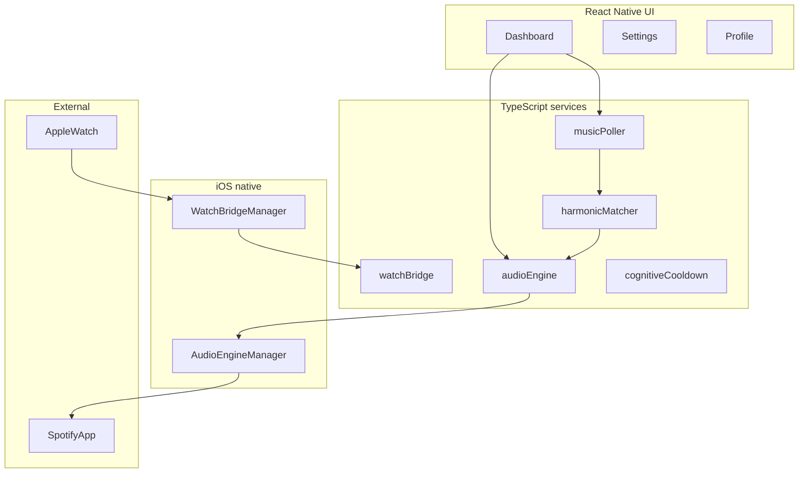

# Dialed — Architecture Specification

**Version:** 1.0  
**Bundle ID:** `com.brandonlo05.dialed`  
**Platform:** iOS-first (Expo SDK 54 + custom dev client), Android secondary

---

## 1. Product intent

Dialed is a premium focus-entrainment app that plays **parallel binaural audio** alongside Spotify (and other apps) without ducking or interruption. It optionally:

- Recalibrates carrier tones to the **musical key** of the currently playing Spotify track (<3s target).
- Streams **Apple Watch biometrics** (BPM + RR intervals) into the host app for future adaptive entrainment.
- Runs a **Cognitive Cooldown** fractionation timer (work → micro-break → recovery).

Non-goals: replacing Spotify, pharmacological claims, cloud account system (v1).

---

## 2. Stack overview

| Layer | Technology |
|-------|------------|
| UI | React Native 0.81, Expo Router 6, NativeWind v4 (dark-first) |
| Native iOS audio | Expo Module `dialed-audio` — `AVAudioEngine` + `AVAudioSourceNode` |
| Native iOS watch bridge | Expo Module `dialed-watch` — `WatchConnectivity` |
| watchOS companion | Xcode target scaffold (`ios-templates/DialedWatch`) + `HKWorkoutSession` |
| Spotify | Web API (`/v1/me/player/currently-playing`, audio-features); OAuth user token |
| Build / ship | EAS (`eas.json`), TestFlight via `production` profile |



---

## 3. Repository layout

```
app/                    # Expo Router screens
src/
  components/           # GlassCard, StatBox
  constants/modes.ts    # Four focus modes + stat copy
  services/             # audioEngine, musicPoller, harmonicMatcher, spotify*, watchBridge, cognitiveCooldown
modules/
  dialed-audio/ios/     # AudioEngineManager.swift, DialedAudioModule.swift
  dialed-watch/ios/     # WatchBridgeManager.swift, DialedWatchModule.swift
ios-templates/          # Privacy manifest template, watchOS Swift sources
ios/ android/           # Generated by `expo prebuild` (gitignored partially)
```

---

## 4. Focus modes (UI ↔ audio)

| Mode ID | Title | Beat (Hz) | Default carrier (Hz) | Brown noise |
|---------|-------|-----------|----------------------|-------------|
| `standard-focus` | Standard Focus | 10 | 220 | On |
| `deep-lockdown` | Deep Lockdown | 40 | 200 | Off |
| `caffeine-rush` | Caffeine Rush | 20 | 240 | Off |
| `clutch-mode` | Clutch Mode | 7 | 180 | Off |

**Binaural rule:** Left channel = `carrierHz`, right channel = `carrierHz + beatHz` (true stereo, not mono mix).

---

## 5. Audio engine (`AudioEngineManager`)

### 5.1 Session policy

- `AVAudioSession` category: `.playback`
- Options: **`.mixWithOthers`** — mandatory for Spotify coexistence
- Background mode: `audio` in `Info.plist`

### 5.2 Signal path

1. **Binaural node** — `AVAudioSourceNode`, stereo L/R sine generators, 12ms gain ramp on start/stop
2. **Brown noise node** — first-order Brownian integrator, mono to both channels, 20% of binaural volume when enabled
3. Both connect to `mainMixerNode`

### 5.3 Thread safety

- `RenderParams` protected by `os_unfair_lock`; render callback reads snapshot only
- Phase accumulators live on render thread only

### 5.4 Interruptions

- `AVAudioSession.interruptionNotification`: pause on began, resume on ended if `.shouldResume`
- Route change: pause on `oldDeviceUnavailable` (unplug), resume on `newDeviceAvailable`

### 5.5 JS bridge (`DialedAudioModule`)

- `startSession({ carrierHz, beatHz, brownNoiseEnabled })`
- `stopSession()`, `setCarrierFrequency(hz)`, `setBeatFrequency(hz)`, `setVolume(0–1)`, `setBrownNoiseEnabled(bool)`

---

## 6. Harmonic matcher (Phase 4)

### 6.1 Data flow

1. `musicPoller` polls Spotify **currently-playing** every 2s while session active
2. Track change debounced 1s (gapless-safe)
3. `harmonicMatcher.recalibrateCarrierFromTrackId` fetches **audio-features** (key, mode, tempo)
4. `carrierHz = baseCarrierHz × 2^(semitoneOffset/12)`, clamped **80–480 Hz**
5. `setCarrierFrequency` on native module

### 6.2 Auth

- User OAuth bearer via `spotifyAuth` / `spotifyClient.setUserToken`
- Without token: audio plays on mode defaults; poller no-ops

### 6.3 UI feedback

- Dashboard shows Camelot badge + key label when `MatchResult` arrives

---

## 7. watchOS companion (Phase 3)

### 7.1 Watch → iOS packet

```json
{ "bpm": 72.5, "rrIntervals": [820, 810, ...], "timestamp": 1710000000 }
```

### 7.2 iOS host

- `WatchBridgeManager` decodes JSON via `WCSession`
- `DialedWatchModule` exposes events to JS
- `RRIntervalRingBuffer` in `watchBridge.ts` — size 256, handles lossy BT

### 7.3 Watch app (template)

- `HKWorkoutSession` keeps heart-rate sensor active in background
- `WorkoutManager` + `WatchConnectivityBridge` in `ios-templates/DialedWatch`

---

## 8. Cognitive Cooldown (Phase 5)

State machine: `idle → work → micro-break → recovery → idle`

| Phase | Default duration |
|-------|------------------|
| work | 25 min |
| micro-break | 90 s |
| recovery | 5 min |

Implemented in `src/services/cognitiveCooldown.ts`; wire to UI in future sprint.

---

## 9. Privacy & compliance

- Template: `ios-templates/PrivacyInfo.xcprivacy` — copy into `ios/Dialed/` after prebuild
- Declares: System boot time (35F9.1), UserDefaults (CA92.1)
- HealthKit usage strings in `app.json` `infoPlist`

---

## 10. EAS build profiles

| Profile | Purpose |
|---------|---------|
| `development` | Simulator dev client |
| `development-device` | Physical device dev client |
| `preview` | Internal distribution |
| `production` | TestFlight / App Store, autoIncrement |

---

## 11. Development commands

```bash
export PATH="$HOME/.local/node/bin:$PATH"
npm install --legacy-peer-deps
npx expo prebuild
npx expo run:ios
```

Signing: Apple Development Team required in Xcode for device builds; bundle `com.brandonlo05.dialed`.

---

## 12. Phase completion checklist

- [x] Phase 0 — Expo, NativeWind, EAS, spec links
- [x] Phase 1 — Dashboard, stats, navigation
- [x] Phase 2 — Parallel audio engine
- [x] Phase 3 — Watch bridge + ring buffer
- [x] Phase 4 — Spotify poll + harmonic recalibration
- [x] Phase 5 — Cooldown FSM, privacy template, EAS production profile
- [ ] TestFlight upload (requires EAS credentials + Apple account)
